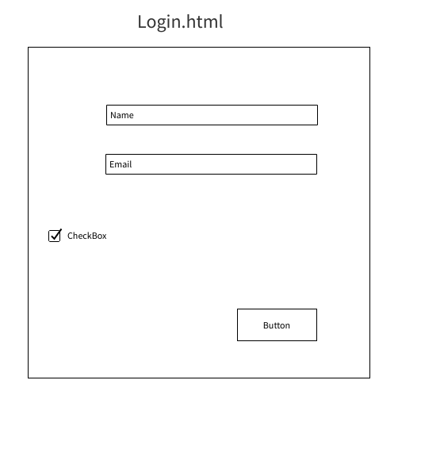
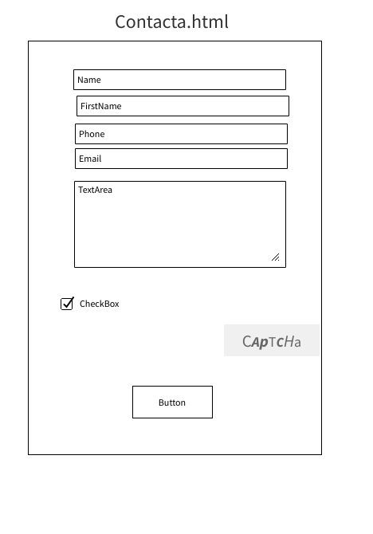

## Explicacion previa

voy a crear una pagina web para la venta de Ropa y Accesorios de motos para captar los clientes de tal sector.

## Lluvia de ideas (sopesar las ideas y motivos de descarte) (10 minimo)

- idea 1:
  Tienda online
- idea 2:
  Tienda segunda mano
- Idea 3:
  Red social
- Idea 4:
  Mailing
- Idea 5:
  Red social de citas
- Idea 6:
  compartir archivos online
- Idea 7:
  foro
- Idea 8:
  portal de noticias
- Idea 9:
  Banco
- Idea 10:
  Venta de accesorios y ropa de motos (elegida)

  Me gusta esta idea y la escojo porque s

# Nombre del proyecto: **Banco**

## Descripcion del proyecto:

Este proyecto sera un frontEnd donde se pueda ver productos que puedan ser comprados y pagados por parte de los clientes.

## Descripcion de las carcteristicas

Es una web que permite a los clientes ver y comprar Ropa y Accesorios relacionados con el mundo del motor

## Viabilidad:

### Usuarios potenciales

para hombres/mujeres de entre 16 hasta 80 años

### Mercado a cubrir

mundo del motor

ventas online

servicio a domicilio

### etc...

...

## Documentacion tecnica

### Base

Se crearan 6 html y estos tendran **cargas dinamicas de otros ficheros** para importar fragmentos como el menu y...
se usara CSS y o Boostrap para..
Utilizare JS para...

### Herramientas

- Github para la documentacion y subir los distintos archivos a sus repositorios.

- PhpMyAdmin y freemysqlhosting para confirmar el registro.

## Diagrama de grantt (se puede entregar fuera del md)

[diagramagrantt.xlsx](./diagramagrantt.xlsx)

## wireframes

[]()

## Paths

## Mokups

## Casos de uso

comprar ropa especial para motoristas

- cascos
- guantes
- botas

## Lenguajes, codigos, bibliotecas y frameworks serán usados:

1. Html5
2. Css3
3. JavaScript
4. Php
5. Boostrap
6. FontsAwesome
7. Fonts
8. Jquery
9. MySQL- MariaDB

## Herramientas

`````
 Utilización de  GitHUb para controlar las versiones mediante repositorios, se usara la web ````.
 Se usará una  una DB en internet para poder tener acceso a ella 365 días.
 Heroku  se utilizará parar tener un servidor de php.
Se mantendrán las  librerias actualizadas.

`````

## Realizar un diagrama de Gantt


## Wireframes







## Path


## Mockup


## Casos de uso

- SignIn

- LoginIN

- Contacta con nosotros

##

1. SignIn

   `En este apartado los clientes van a poder darse de alta desde un formulario introduciendo información personal básica como Nombre, Apellidos, Dni, Email...`

2. LoginIN

   ` Una vez registrados los clientes van apoder acceder a su espacio personal mediante su nombre y su email`

3. Contacta con nosotros
